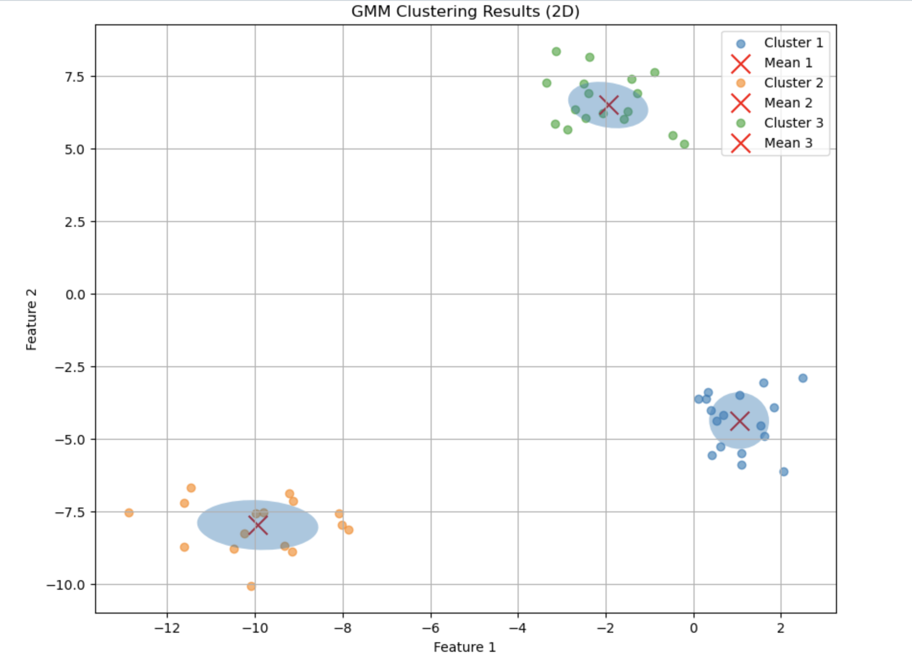

# GMM (Gaussian Mixture Model)

This repository contains two implementations of the Gaussian Mixture Model (GMM) in Python—one is a basic, scratch implementation, and the other is an improved version using Object-Oriented Programming (OOP) principles and advanced techniques.

## Introduction

Welcome to my implementation of the Gaussian Mixture Model (GMM) in Python. The repository includes two versions of the GMM:

1. **Old Implementation**: A basic, non-OOP implementation of the GMM, created from scratch.
2. **Improved Implementation**: A more robust, object-oriented version that addresses the limitations of the previous implementation.

### Shortcomings of the Old Implementation:

1. **Random Initialization of Means**: The model initializes means randomly, which can lead to poor performance and instability in results.
2. **Lack of Object-Oriented Programming (OOP)**: The code is not structured with OOP principles, making it less modular and reusable.
3. **Assumption of Feature Independence**: The model assumes that features are independent of each other, neglecting the correlation between them (i.e., no use of covariance).
4. **Unstable Results**: The model produces inconsistent results when run multiple times due to poor initialization and lack of a more refined approach.

### Improvements in the Second Implementation:

1. **K-means Initialization**: The means are initialized using the standard K-means clustering algorithm, improving the stability and accuracy of the results.
2. **Feature Correlation**: The improved implementation takes into account the inter-dependence of features and utilizes a covariance matrix to model the relationships between them.
3. **Covariance Matrix Regularization**: The model ensures the covariance matrix remains positive semi-definite by applying a tolerance of `1e-5` to prevent singularities.
4. **Increased Robustness**: Overall, the improved implementation is more stable, efficient, and produces better results with less sensitivity to initialization.

## Files in This Repository

- `GaussianMixtureModel.ipynb`: The older, scratch implementation of the GMM.
- `Production Grade GMM.ipynb`: The new, object-oriented implementation with enhancements for stability and performance.

## Usage 

To use the code, download the jupyter notebook and select appropriate python version and install the packages 
- numpy
- matlplotlib
- sklearn
- scipy

Post this, you just need to run the notebook!
At the end of the notebook you can see the comparison of our code with sklearn's results!
# Result 

# License
This project is licensed under the MIT License. 
